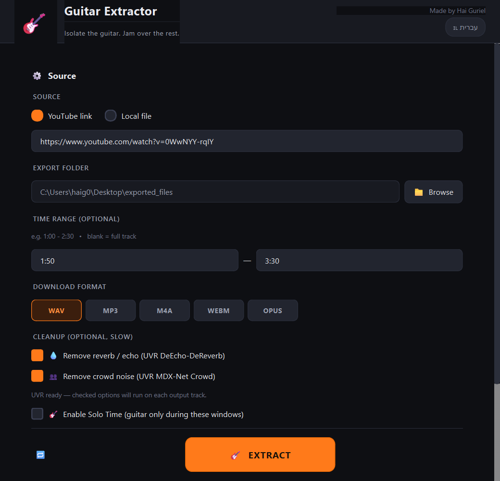
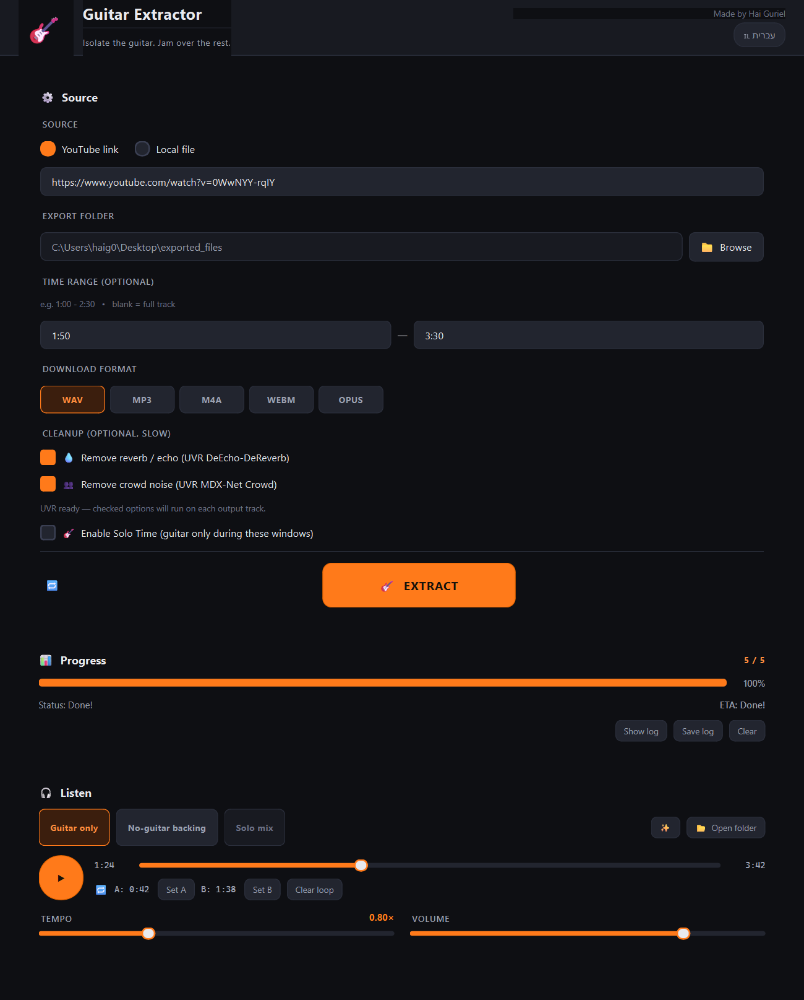

# 🎸 Guitar Extractor

**Made by Hai Guriel**

Isolate the guitar from any song, export a **play-along video with the guitar removed**, and **auto-detect the chords** — burned right onto the video so they run on screen as you play. Built-in player with A/B loop, tempo control, live chord readout, and UVR de-reverb / de-crowd. PySide6 + Demucs + librosa + audio-separator.



---

## What it does

Feed it a **YouTube link** or a **local audio file**. It runs Demucs' 6-stem model
(`htdemucs_6s`) and gives you back:

- `<song>_guitar.wav` — the isolated guitar track, great for transcribing or learning a riff.
- `<song>_no_guitar.wav` — everything else (drums + bass + vocals + piano + other), perfect as a backing track to jam over.

Optionally it also gives you:

- `<song>_no_guitar_video.mp4` — a **play-along video**: the original video with the guitar removed from the audio, so you can watch and play along.
- `<song>_chords.txt` / `.lrc` / `.srt` — a **timed chord sheet** detected from the isolated guitar. When you export the video too, the chords are **burned onto it** (current chord plus the next ones coming up, flowing as time goes).

Then it drops you into a built-in player with A/B/C switching, a scrubbable timeline,
**loop A–B** for drilling a tough passage, a **tempo slider (0.5×–1.5×)** to slow
a solo down and pick it apart, and a **live chord display** that shows the current and upcoming chords as it plays.

---

## Features

- 🎯 One-click extraction: guitar + no-guitar backing track
- 🎬 **Play-along video** — export the source video with the guitar removed from the audio
- 🎼 **Chord detection** — auto-detect chords from the guitar stem (`.txt` / `.lrc` / `.srt`), with a live current + upcoming chord readout in the player
- 📺 **Chords on screen** — when video + chord detection are both on, the chords are burned onto the play-along video and flow as it plays
- 🎧 **Built-in player** with instant A/B between the isolated guitar and the backing
- 🔁 **Loop A–B** — set two points, loop the section for practising
- ⏩ **Tempo control** — slow a solo to 0.5× without leaving the app
- ✂️ **Time range** — process only part of a song (saves a lot of time)
- 🎸 **Solo Time mode** — mark the windows where the guitar plays and get a single mix where the guitar only appears inside those windows (the band still plays throughout)
- 📁 **Per-song output folders** — each song gets its own subfolder under the export root
- 🚀 GPU acceleration auto-detected (CUDA)
- 🌍 English / Hebrew UI with RTL layout switching
- ⌨️ Keyboard shortcuts — `Space` play/pause, `Ctrl+Enter` start extract, `Esc` cancel



---

## Quick start

1. Install **Python 3.10+** (tick *Add Python to PATH* in the installer).
2. Install **FFmpeg**:
   ```powershell
   winget install Gyan.FFmpeg
   ```
3. Install Python dependencies:
   ```bash
   pip install -r requirements.txt
   ```
   — or double-click `install_dependencies.bat`.
4. Run:
   ```bash
   python main.py
   ```
   — or double-click `run.bat`.

First run will download the Demucs `htdemucs_6s` weights (~350 MB) once.

---

## Pipeline steps

| # | Tool                  | What it does                                                       |
|---|-----------------------|--------------------------------------------------------------------|
| 1 | yt-dlp                | Downloads audio from YouTube — and the video too, if you enabled the play-along export (skipped for local files) |
| 2 | ffmpeg                | Converts to 44.1 kHz stereo WAV; trims to your time range if set   |
| 3 | Demucs `htdemucs_6s`  | Splits into drums, bass, vocals, piano, other, **guitar**          |
| 4 | ffmpeg                | Copies the guitar stem; sums the other 5 into the backing track    |
| 5 | librosa               | *Optional* — detects chords from the guitar stem → `.txt` / `.lrc` / `.srt` |
| 6 | ffmpeg                | *Optional* — muxes the backing (or solo) audio over the video and **burns in the chords** |
| 7 | UVR (`audio-separator`) | *Optional* — de-reverb / de-crowd each output track              |

Output lands in a **per-song subfolder** under your export root —
`<export_folder>/<song name>/` (the default export root is `Desktop\Backing Tracks`).
With both UVR boxes ticked you'll also get `_dry.wav`, `_reverb_echo.wav`,
`_clean.wav`, and `_crowd.wav` variants for every track. The reverb-echo and crowd
files are the *isolated residuals* — exactly what got removed — so they can be
layered back in selectively.

**Solo Time** replaces step 4 with a single masked mix — the full band keeps playing,
but the guitar only fades in during the segments you specified.

### Optional UVR models

Place these in [resources/models/](resources/models/) (or `resources/`) to enable the
*Cleanup* options:

- `UVR-DeEcho-DeReverb.pth` — for *Remove reverb / echo*
- `UVR-MDX-NET_Crowd_HQ_1.onnx` — for *Remove crowd noise*

The GUI shows live status under the checkboxes if either model or the
`audio-separator` package is missing.

---

## Play-along video & chord detection

Two optional checkboxes turn the extractor into a practice tool:

- **🎬 Export play-along video (guitar removed)** — needs a video source (a YouTube
  link, or a local *video* file). The original video is kept and its audio is
  replaced with the guitar-removed backing track, so you can watch and play along.
- **🎼 Detect chords** — runs chord detection on the isolated guitar stem and writes
  `<song>_chords.txt`, `.lrc`, and `.srt`.

Enable **both** and the chords are **burned onto the video** at the top of the
frame, showing the chord playing now plus the next ones coming up
(e.g. `Am → G D`). Each chord stays on screen until the next begins, so the chart
flows continuously. The in-app player shows the same current + upcoming chords live.

**How chord detection works:** CQT chroma → fixed ~0.25 s blocks → cosine match
against the 24 major/minor triad templates (root & 3rd weighted above the shared
5th) → energy gate for silence → majority-vote smoothing → run-length merge. It
uses only `librosa` + `numpy` — no extra model downloads.

**Accuracy & limits:** strongest on clean, triadic playing — it reports chord
*names* (e.g. `Am`, `F`), not fingerings, inversions, or extended qualities
(7ths / 9ths / sus). Heavy distortion, sparse playing, or fast changes can trip it
up. Treat it as a fast, helpful first pass, not a note-perfect transcription.

---

## Requirements

| Component | Minimum                         |
|-----------|---------------------------------|
| OS        | Windows 10 / 11                 |
| Python    | 3.10+                           |
| RAM       | 8 GB (16 GB recommended)        |
| GPU       | Optional — 4+ GB CUDA is 5–10× faster |
| Disk      | ~3 GB for model weights + working space |

---

## Shortcuts

| Key             | Action                |
|-----------------|-----------------------|
| `Ctrl + Enter`  | Start extraction      |
| `Space`         | Play / pause the result |
| `Esc`           | Cancel a running job  |

---

## Troubleshooting

| Problem                      | Fix                                                                                              |
|-----------------------------|--------------------------------------------------------------------------------------------------|
| "yt-dlp not found"           | `pip install -U yt-dlp`                                                                          |
| "ffmpeg not found"           | `winget install Gyan.FFmpeg` (then restart your terminal)                                        |
| Demucs crashes / slow        | Run with CPU only (default); close other apps; ensure ~4 GB free RAM                             |
| Hebrew text looks off        | Switch to English via the header button; Hebrew needs a system font that covers Hebrew glyphs   |

---

## License

For personal use. Made by Hai Guriel. Not affiliated with YouTube, Demucs, or FFmpeg.
